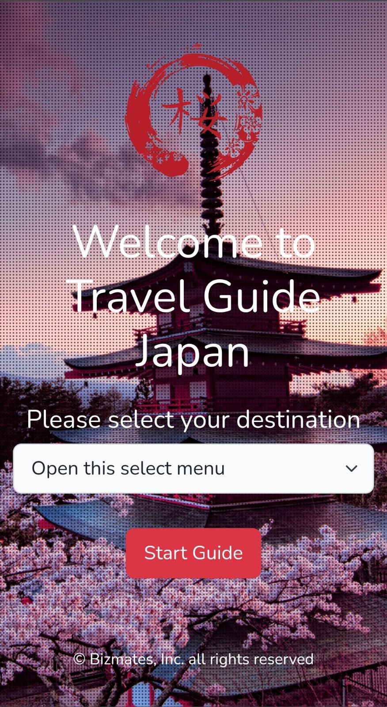
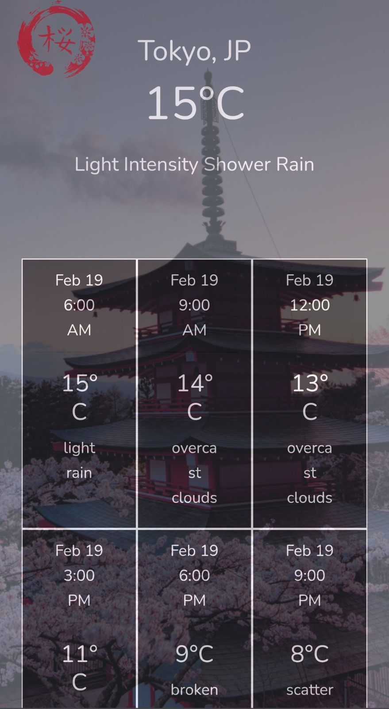
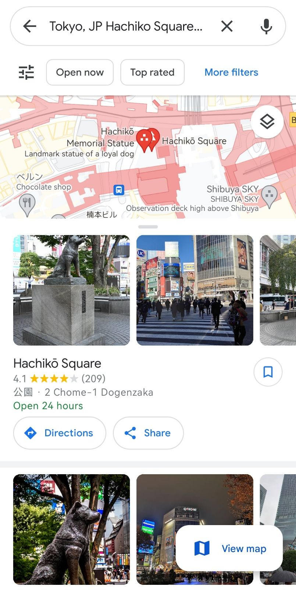
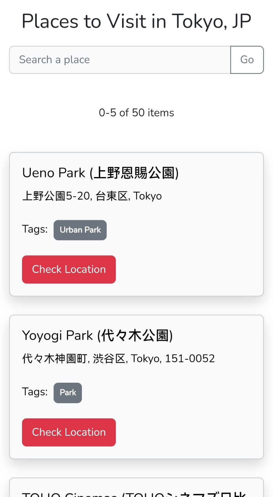
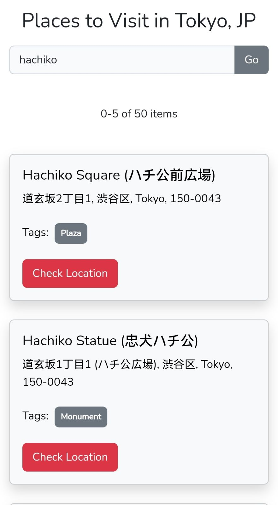

## Travel Guide Japan

Travel Guide Japan is a travel information site for foreign tourists who wishes to visit Japan. This site contains detailed information of the weather and places near your desired destination. It's a user friendly and interactive site to discover the famous cities in Japan like Tokyo, Yokohama, Kyoto, Osaka, Sapporo, and Nagoya.

Travel Guide Japan showcases the following features:

- Simple and clean front page to select a destination.
- Realtime weather information.
- 3-hour weather forecast.
- Top 50 places to visit.
- Search a place of your choice.
- External map locator using Google Map.

## Installation

Travel Guide Japan is made from a popular PHP framework called Laravel. The UI/UX design is based on Bootstrap CSS framework and VueJS frontend javascript framework. Before installing the site, visit the following documentation to setup your production environment:

- [LAMP](https://www.digitalocean.com/community/tutorials/how-to-install-linux-apache-mysql-php-lamp-stack-on-ubuntu-20-04) or [LEMP](https://www.digitalocean.com/community/tutorials/how-to-install-linux-nginx-mysql-php-lemp-stack-on-ubuntu-20-04)
- [Laravel](https://laravel.com/docs/8.x/installation)
- [Bootstrap UI & VueJS UI](https://laravel.com/docs/7.x/frontend)
- Additional component: [Vue Spinner](https://github.com/greyby/vue-spinner)

Provide the API credentials for the following configuration below from .env to extract weather and places information:

- OPENWEATHERMAP_KEY=
- FOURSQUARE_KEY=

*OPENWEATHERMAP_KEY is available at [https://openweathermap.org/forecast5](https://openweathermap.org/forecast5) and FOURSQUARE_KEY at [https://location.foursquare.com/developer/reference/places-api-get-started](https://location.foursquare.com/developer/reference/places-api-get-started).

## Design Choice

The site is designed to be mobile-first. Most foreign tourists will use their portable and/or mobile devices to discover Japan as it's readily accessible anywhere and anytime. The site will determine your desired destination to filter your searches and provide information based on the rating of the place.

## License

This project is an application requirement for an interview. The interviewer and company has the right to make use of the source code for their use. Distribution of this project for third party users is limited for educational purposes only.
